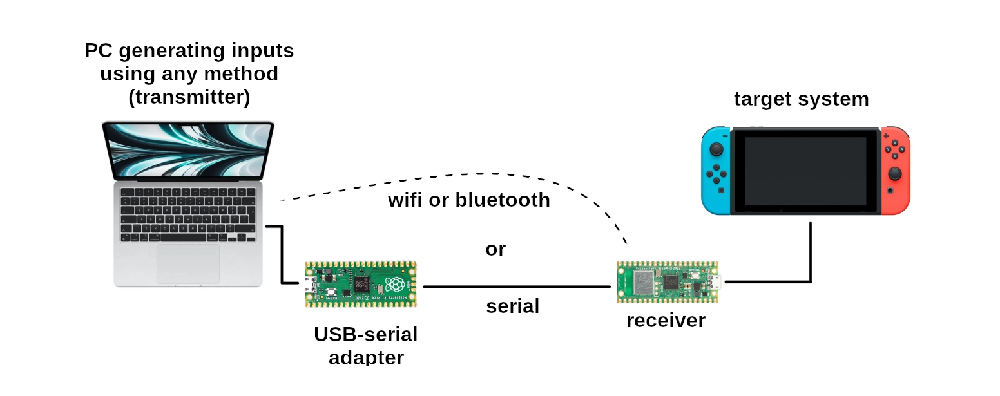

# HID Forwarder

_Please note his project is at a proof of concept stage._

This project proposes a remote control system for USB input devices, where the inputs can be generated on a PC running any software, and then sent to the target system via a receiver that emulates a USB input device like a game controller or keyboard and mouse.

The idea is that the PC can generate the inputs using methods like eye tracking, EEG interfaces, physical controllers, or any combination of them, and then send them to a receiver that acts as a controller to the target system, which might be a game console or some other system without the means to run custom software on it.



There are currently two protocols for communication between the transmitter and the receiver: networked (wifi) and wired (serial). Additional ones like Bluetooth might be added in the future.

## Receivers

The receiver can either be a Raspberry Pi Pico running the [receiver_pico.uf2](receiver-pico/receiver_pico.uf2) firmware or a Pico W running the [receiver_pico_w.uf2](receiver-pico/receiver_pico_w.uf2) firmware. The Pico variant supports wired (serial) communication with the transmitter and the Pico W variant supports both wired and wireless (wifi) communication.

To configure the wifi network on the wireless receiver, use this web based [configuration tool](https://www.jfedor.org/hid-receiver-config/).

The input device type that the receiver is emulating (mouse, keyboard, gamepad) can also be configured using this tool, but the receiver will also switch and remember the device type if it receives inputs for a different device type than it's currently configured to emulate.

## Serial wiring

If you want to use a wired connection between the transmitter and the receiver, you will need some kind of a USB-to-serial adapter for your computer. For this you can use a dedicated adapter or a Raspberry Pi Pico running the [Debug Probe](https://github.com/raspberrypi/debugprobe) firmware.

Wire the TX pin on your USB-to-serial adapter to GPIO5 on the receiver (pin 7 on the Pico).

If you're using a Pico running the Debug Probe firmware as a USB-to-serial adapter, TX on that is GPIO4 (pin 6).

Also wire GND to GND between the USB-to-serial adapter and the receiver Pico.

## Network protocol

The networked mode of communication uses UDP packets and currently has no acknowledgment or retransmission so it is realistically only suited for local networks where we can expect no packet loss.

It currently has no encryption or authentication so it's susceptible to **eavesdropping** and **input injection**. _Make sure you understand the implications._

## Transmitters

A few sample transmitters are provided. Some of them generate synthetic inputs and some capture inputs from a gamepad connected to your PC and forward them to the receiver. You might want to use one approach or the other, depending on what you're using to generate the inputs.

If during testing you connect the receiver to the same PC that's running the transmitter, and you're using one of the transmitters that forward inputs from all connected gamepads, you might run into the infinite mirror/loop issue. The transmitters make an attempt to avoid it using the device name. Your mileage may vary.

### Web transmitter

This is a web application, you can see a live version of it [here](https://www.jfedor.org/hid-transmitter/). It is only compatible with the wired mode of communication to the receiver. Click the "Select serial port" button, choose the port corresponding to your USB-to-serial adapter and then it should forward the inputs from any connected gamepads to the receiver.

### Python transmitters

Two gamepad transmitters written in Python are provided. `gamepad_test.py` generates synthetic inputs and `gamepad_forward.py` captures inputs from any connected gamepad and forwards them to the receiver.

To use the transmitters in wired mode, use the `--serial-port` command line parameter with the device name of you USB-to-serial adapter. Depending on your operating system and the adapter you're using, it will be something like `COM3` or `/dev/ttyACM0`.

To use the transmitters in networked mode, use the `--address` command line parameter with the IP address of the receiver. There's currently no way to ask the receiver what IP address it got via DHCP so check on your access point or router.

To use the serial mode of communication you need to have the [pyserial](https://github.com/pyserial/pyserial) module installed. To use the `gamepad_forward.py` transmitter, you need [pyglet](https://pyglet.org/). Both can be installed with pip.

## Console compatibility

The system is directly compatible with the Nintendo Switch using the "Switch gamepad" emulated device type. If you want to use it with other consoles, you will have to use some kind of an adapter or intermediary device. For the PS5 you can plug the receiver into a Brook Wingman FGC2 adapter and use the "PS4 arcade stick" emulated device type. For Xbox you can plug the receiver into an Xbox Adaptive Controller and use the "XAC/Flex compatible" emulated device type. Other adapters might work as well.

Please note only Switch gamepad transmitter examples are currently provided (but it's a simple modification).

## How to compile the Pico receiver

```
git clone https://github.com/jfedor2/hid-forwarder
cd hid-forwarder
git submodule update --init
cd receiver-pico/pico-sdk
git submodule update --init
cd ..
mkdir build
cd build
cmake ..
# or, if you want to compile for the Pico W:
# cmake -DPICO_BOARD=pico_w ..
make
```
